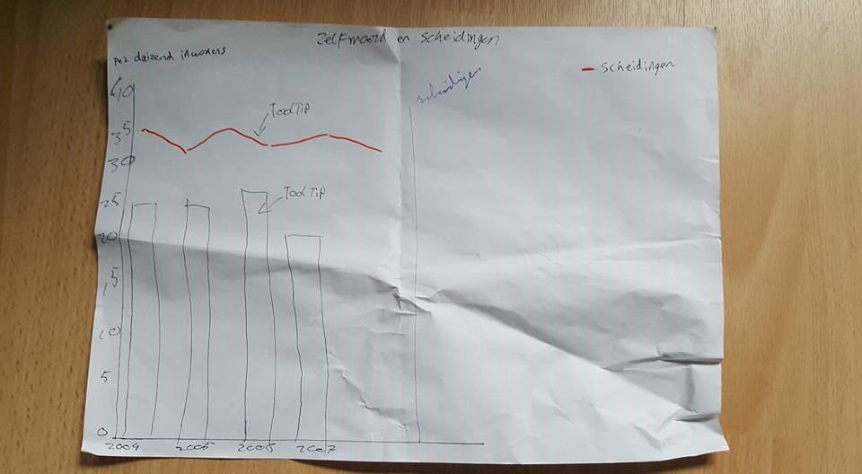
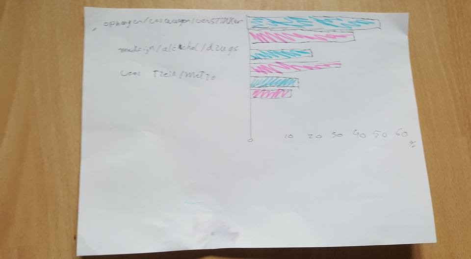

# Individuele project opdracht A

![cover]

### De opdracht
Voor opdracht A heb een 3 charts gebruikt om te bepalen hoe zelfmoord zo gestegen kan zijn. 
Voor de opdracht wou ik de volgende inzichten kunnen zien:
* Wie pleegt het meeste zelfmoord op het gebied van geslacht? 
* Welke leeftijdsgroep van dit geslacht pleegt het meeste zelfmoord?
* Wat is de reden dat deze leeftijdsgroep zoveel zelfmoord pleegd?
* Is het zelfmoord gestegen door de loop van jaren?

### Het process

Het process verliep een beetje stroef. Ik had me eerst gefocussed op zelfmoord en de burgelijke staat. Dit moest aantonen dat
scheidingen invloed heeft op zelfmoord, maar ik had geen bewijs of goed genoeg onderzoek ernaar gedaan om dit te kunnen zeggen.
Ik ging dus meer op onderzoek uit om een goed verband te kunnen vinden. Ik ging eerst opzoek naar het geslacht van de mensen die zelfmoord pleegde.
Dit laat zien dat mannen in een overgrote meerderheid zijn in vergelijking met vrouwen. Ook is te zien hoe zelfmoor door de jaren aan het stijgen is.
Ik besloot toen om te zoeken naar de leeftijden van wanneer mensen zelfmoord plegen. Dit liet al snel zien dat mannen vanaf 40 jaar
steeds meer zelfmoord plegen. Waarom is dit zo?

Om erachter te komen waarom zelfmoord zo erg omhoog gaat ging op Googlen op 'waarom zoveel zelfmoord'. Dit bleek alleen maar artikelen
te zijn over waarom mannen zoveel zelfmoord plegen. Hierin stond er dat het komt, omdat mannen meer gesloten zijn kwa emoties. Ook
kwam ernaar boven dat de relatie met hun ouders (en dan voornamelijk met de vader) erg slecht is. Dit komt door een scheiding tussen
de ouders. Persoonlijk kan ik hiervan uit ervaring plegen, omdat dit ook voor mij geldt. Met dit te weten kon ik het aantal scheidingen
koppelen aan het aantal zelfmoord. Ik heb dit dan ook beide in één bar gezet. Nu valt er te zien dat de sprongen van scheidingen en 
het aantal zelfmoord te gelijk oplopen.

### Het coderen
Coderen ging half goed en half slecht. Het moeilijkste gedeelte was het zoeken van een barchart die een lijn bevat. Dit kon ik niet vinden.
Na heel lang zoeken kon ik eindelijk een graph vinden op codepen na het zoeken op pagina 20. Helaas bevatte deze graph v3 code in plaats van v4
en de data zat in een variabele in plaats van een JSON/tsv/csv bestand. Ik besloot toch dit allemaal zelf om te zetten naar v4 en om
de data in een JSON te stoppen. Het omzetten naar v4 was erg lastig, maar ik kon dit zelfstandig en met veel Google zelf oplossen. Na
het omzetten van de code en na het oproepen van de data via JSON moest ik nog een nieuwe Y as maken voor de rechterkant, omdat dit een andere schaal gebruikt.
Dit was ook niet al te moeilijk. De andere 2 graphs waren makkelijk om te doen en een voorbeeld online ervan zoeken was geen probleem.

### De werking
Ik heb het zo neergezet dat je langs de graphs kan gaan en het bijbehorende verhaal erbij kan lezen. Op de eerste 2 graphs heb ik een tooltip
gezet, omdat het anders moeilijk was te zien wat de data is. Op de laatste graph heb ik de optie neergezet om de lijn van scheidingen weg te halen,
omdat het misschien voor verwarring kan brengen.

### Bronnen
* [Grouped bars](https://bl.ocks.org/mbostock/3887051)
* [Code omzetten naar v4](https://iros.github.io/d3-v4-whats-new/#1)
* [Weghalen van een lijn](http://bl.ocks.org/d3noob/5d621a60e2d1d02086bf)
* [Dataset](https://www.cbs.nl/nl-nl/nieuws/2016/26/meer-zelfdodingen)
* [Dataset](http://statline.cbs.nl/Statweb/publication/?VW=T&DM=SLNL&PA=7052_95&D1=0,8,34,38,42,49,79,82,84,88&D2=1-2&D3=a&D4=l&HD=160628-1345&HDR=G2&STB=G3,G1,T)
* [Artikel waarom mannen zoveel zelfmoord plegen](https://revu.nl/artikel/waarom-plegen-zoveel-mannen-zelfmoord)
* [Artikel waarom mannen zoveel zelfmoord plegen](https://www.rtlnieuws.nl/nederland/waarom-plegen-mannen-vaker-zelfmoord-dan-vrouwen)
* [Artikel waarom mannen zoveel zelfmoord plegen](https://www.nrc.nl/nieuws/2017/09/15/we-hebben-mijn-broer-laten-wegglippen-13016502-a1573465)

[cover]: preview.png
